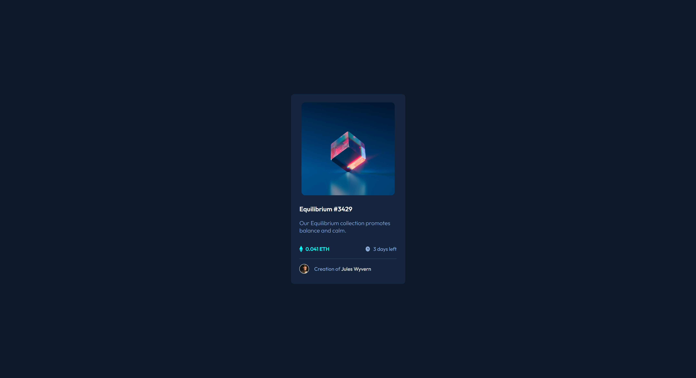

## Table of contents

- [Overview](#overview)
  - [Screenshot](#screenshot)
  - [Links](#links)
- [My process](#my-process)
  - [Built with](#built-with)
  - [What I learned](#what-i-learned)
  - [Continued development](#continued-development)
- [Author](#author)

## Overview

Your challenge is to build out this preview card component and get it looking as close to the design as possible.

You can use any tools you like to help you complete the challenge. So if you've got something you'd like to practice, feel free to give it a go.

Your users should be able to:

- View the optimal layout depending on their device's screen size
- See hover states for interactive elements

### Screenshot

### Links

- Solution URL: [Solution](https://www.frontendmentor.io/solutions/results-summary-component-6zpPHXUzZa)
- Live Site URL: [Live](https://genuinemiyashita.github.io/NFT-Preview-Card/)

## My process

Started with the mobile approach and worked my way up to larger breakpoints. Tried taking into account both landscape and portrait mode for breakpoints around an ipad Mini/Air.

### What I learned

Getting comfortable with vanilla HTML/CSS, however, this time I tried to focus around media queries and just trying different situations out before settling on the selected breakpoints, which I based off Bootstrap's breakpoints for devices. I believe that this challenge marks the graduation into CSS frameworks and breaking those until I understand them.

### Continued development

As mentioned in the previous section, I'm going to move into utilizing or attempting to utilize CSS frameworks and getting practice with them where possible. It highly depends on future challenges as it might just be completely unnecessary to add them compared to just vanilla CSS.

## Author

- Frontend Mentor - [@GenuineMiyashita](https://www.frontendmentor.io/profile/GenuineMiyashita)
